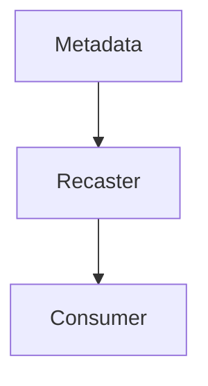

## Recasters

Patch Envelopes provide a way to modify your EdgeApplication, in some cases you
can't change your EdgeApplication, because it's provided by 3rd party or maybe
it's legacy, however those EdgeApplications expose a way to communicate: be it
REST API, ssh, SMTP, etc. This is where recaster could help you. You can think
of it as another Edge Application running in parralel with your immutable
Consumer and serving as a proxy: it consumes PatchEnvelopes from Metadata
server and converts them (recast) to appropriate way of communication with
Consumer (REST API call, ssh, SMTP, etc.)



### How to run it?

Note: You should have golang [installed](https://go.dev/doc/install)

If you want to see how it works locally, you should run mock-consumer

```bash
$ cd ./cmd/mock-consumer && go build && ./mock-consumer
```

Then you should run mock-metadata

```bash
$ cd ./cmd/mock-metadata && go build && ./mock-metadata
```

And lastly srv

```bash
$ cd ./cmd/srv && go build && ./srv
```

Then you can access webUI for recasters at `localhost:8080/index`

Note: if you don't want to use webUI, you can also configure recasters
via json file `config.json` in cmd/srv folder
